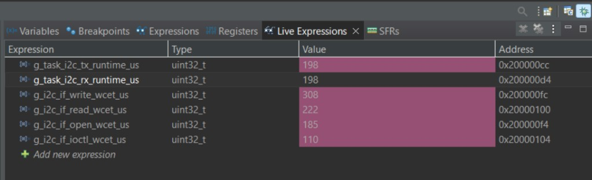

# TP1 – Actividad 01 – Device Driver I2C de FreeRTOS

**CESE – Sistemas Operativos de Tiempo Real II**  
**Trabajo Práctico N° 1 – Device Driver**  
**Cohorte-Grupo:** 26Co2026-01  
**Responsable:** QUISPE LOPEZ, CARLOS (SIU e2614)  
**Plataforma:** NUCLEO-F446RE (STM32F446RE)  
**Toolchain:** STM32CubeIDE / GNU Tools for STM32  

---

## Paso 01: Generar el proyecto STM32

El proyecto **sotrii-tp1_01-application** fue generado con STM32CubeMX, importado en STM32CubeIDE y compila sin errores (**Project → Build All**).

---

## Paso 02: Crear el archivo de entrega

Se creó el archivo de entrega **`sotrii-tp1_01-application.md`** (este documento) en la raíz del proyecto, junto con **`README.md`** (carátula del TP).

---

## Paso 03: Análisis del código fuente base

Análisis de la funcionalidad del código base incluido en el proyecto:

| Archivo | Función principal |
|---------|-------------------|
| `app/src/app.c` | Inicialización de la aplicación (`app_init`), creación de tareas y arranque del scheduler FreeRTOS |
| `app/src/app_it.c` | Manejadores de interrupciones de la aplicación |
| `app/src/task_sender.c` | Tarea periódica que envía datos; en la demo final inicializa el LCD y actualiza la pantalla |
| `app/src/task_receiver.c` | Tarea periódica complementaria; registra actividad en consola |
| `app/src/task_i2c.c` | Tareas gatekeeper **TX/RX** que ejecutan las transferencias I2C vía HAL (polling) |
| `app/src/task_i2c_interface.c` | API del device driver: `open_i2c`, `write_i2c`, `read_i2c`, `ioctl_i2c`, `release_i2c` |
| `app/inc/task_i2c_interface.h` | Prototipos de la API y variables globales WCET |
| `app/src/freertos.c` | Configuración de FreeRTOS generada por CubeMX |

El sistema es **Event-Triggered (ETS)**: las tareas se despiertan por temporizador (`vTaskDelay`) y por eventos en colas (driver I2C).

---

## Paso 04: Depurar el nuevo proyecto STM32

Se confirmó mediante depuración en la NUCLEO-F446RE:

- Arranque correcto de `app_init` y de las tareas **Sender**, **Receiver**, **I2C Tx** e **I2C Rx**
- Logs por consola (semihosting / SWV) con el prefijo `[info]`
- Alternancia de tareas cada **250 ms**
- LCD I2C operativo en dirección **0x27**

---

## Paso 05: *(Reservado / actividades intermedias del enunciado)*

---

## Paso 06: Device Driver I2C FreeRTOS — Implementación, prueba y WCET

### 6.1 Aplicación realizada

Se diseñó e implementó un **Device Driver I2C** sobre FreeRTOS que cumple los requisitos del TP:

| Requisito | Implementación |
|-----------|----------------|
| Estructura del dispositivo | `task_i2c_dta_t` (identificador, colas, punteros a tareas gatekeeper) |
| Funciones de interfaz | `open_i2c()`, `release_i2c()`, `write_i2c()`, `read_i2c()`, `ioctl_i2c()` |
| Patrón de diseño | **Synchronous** — la API bloquea hasta que el gatekeeper confirma la transferencia |
| Gestión del periférico | **Polling** — `HAL_I2C_Master_Transmit/Receive` con `HAL_MAX_DELAY` |
| Acceso al hardware | API **STM32-F4 HAL** (`hi2c1`) |
| Tareas gatekeeper | `task_i2c_tx`, `task_i2c_rx` |
| Sincronización | **FreeRTOS Queues** (TX, TX sync, RX request, RX data) |
| Medición WCET | Contador **DWT** + variables globales + reporte por consola |

**Demostración funcional:** LCD 16×2 con expansor **PCF8574** @ dirección **`LCD_DIR 0x27`**, conectado a **I2C1** (SCL **PB8**, SDA **PB9**) @ **100 kHz**.

**Comportamiento en pantalla:**

- Línea 0: texto fijo `"Hola Mundo"`
- Línea 1: dato hexadecimal incrementando (actualizado por `task_sender`)

**Flujo de arquitectura:**

```
  task_sender / pcf8574_lcd
           |
           |  write_i2c() / read_i2c() / ioctl_i2c()
           v
  +---------------------------+
  |  Funciones de interfaz    |  task_i2c_interface.c
  |  (API sincrona + WCET)    |
  +---------------------------+
           |
     queue_tx / queue_tx_sync
     queue_rx_req / queue_rx
           |
           v
  +---------------------------+
  |  Gatekeeper TX / RX       |  task_i2c.c
  |  task_i2c_tx / task_i2c_rx|
  +---------------------------+
           |
           |  HAL_I2C (polling)
           v
        I2C1  --->  PCF8574  --->  HD44780 (LCD)
```

**Inicialización relevante:**

1. `app_init()` → `cycle_counter_init()` + `open_i2c(&hi2c1)` **antes** de `osKernelStart()`
2. Tras arrancar el scheduler, `task_sender` ejecuta `lcd_startup()` (init HD44780 + `ioctl_i2c` para verificar esclavo)
3. Cada ~5 s, `i2c_if_wcet_report()` imprime el bloque WCET en consola

---

### 6.2 Funciones utilizadas

#### API del Device Driver I2C (`task_i2c_interface.c`)

| Función | Descripción |
|---------|-------------|
| `open_i2c(h_i2c)` | Crea 4 colas FreeRTOS y 2 tareas gatekeeper (`task_i2c_tx`, `task_i2c_rx`). Registra el dispositivo en la tabla interna |
| `release_i2c(h_i2c)` | Elimina tareas y colas del driver (no invocada durante la demo en marcha) |
| `write_i2c(h, addr, data)` | Encola 1 byte, espera confirmación del gatekeeper TX (patrón **sync**) |
| `read_i2c(h, addr)` | Solicita 1 byte al gatekeeper RX y bloquea hasta recibirlo |
| `ioctl_i2c(h, cmd)` | Control directo HAL; p. ej. `I2C_IOCTL_IS_DEVICE_READY` → `HAL_I2C_IsDeviceReady` |
| `i2c_if_wcet_report()` | Imprime en consola los WCET acumulados de interfaz y gatekeeper |

#### Tareas gatekeeper (`task_i2c.c`)

| Tarea | Descripción |
|-------|-------------|
| `task_i2c_tx` | Lee de `queue_tx`, ejecuta `HAL_I2C_Master_Transmit`, notifica por `queue_tx_sync` |
| `task_i2c_rx` | Lee petición de `queue_rx_req`, ejecuta `HAL_I2C_Master_Receive`, entrega byte en `queue_rx` |

#### Driver LCD cliente (`pcf8574_lcd.c`)

| Función | Descripción |
|---------|-------------|
| `lcd_startup()` | Init HD44780 vía PCF8574; usa `ioctl_i2c` + `write_i2c` |
| `lcd_clear()`, `lcd_goto()`, `lcd_putc()`, `lcd_puts()` | Operaciones de pantalla; mutex para secuencias multi-byte |
| `lcd_display_hex()` | Muestra valor hex en línea 1 |

#### Tareas de aplicación

| Tarea | Archivo | Rol en la demo |
|-------|---------|----------------|
| `task_sender` | `task_sender.c` | Init LCD, actualiza pantalla, reporte WCET periódico |
| `task_receiver` | `task_receiver.c` | Tarea complementaria con logs cada 250 ms |

#### Medición WCET (DWT)

| Función / variable | Rol |
|--------------------|-----|
| `cycle_counter_init()` | Habilita contador DWT @ SYSCLK 84 MHz |
| `cycle_counter_reset()` / `cycle_counter_get_time_us()` | Mide tiempo en microsegundos |
| `g_i2c_if_*_wcet_us` | Máximo WCET por función de interfaz |
| `g_task_i2c_tx_runtime_us` / `g_task_i2c_rx_runtime_us` | WCET de una iteración del gatekeeper |

---

### 6.3 Estructura del proyecto

```
sotrii-tp1_01-application/
├── README.md                          # Carátula del TP
├── sotrii-tp1_01-application.md       # Este informe (entrega)
├── docs/
│   └── assets/
│       └── live-expressions-wcet.png  # Captura Live Expressions
├── app/
│   ├── inc/
│   │   ├── app.h
│   │   ├── app_it.h
│   │   ├── board.h
│   │   ├── dwt.h
│   │   ├── logger.h
│   │   ├── pcf8574_lcd.h              # Driver LCD (cliente I2C)
│   │   ├── systick.h
│   │   ├── task_i2c.h
│   │   ├── task_i2c_attribute.h       # task_i2c_dta_t, colas, IOCTL
│   │   ├── task_i2c_interface.h       # API + WCET extern
│   │   ├── task_receiver.h
│   │   └── task_sender.h
│   └── src/
│       ├── app.c                      # app_init, open_i2c, scheduler
│       ├── app_it.c
│       ├── freertos.c
│       ├── logger.c
│       ├── pcf8574_lcd.c              # LCD PCF8574/HD44780
│       ├── systick.c
│       ├── task_i2c.c                 # Gatekeeper TX/RX
│       ├── task_i2c_interface.c       # API synchronous + WCET
│       ├── task_receiver.c
│       └── task_sender.c              # Demo LCD + bench WCET
├── Core/                              # Código generado CubeMX (HAL, main, i2c)
├── Drivers/                           # CMSIS + STM32F4 HAL
└── Debug/                             # Artefactos de compilación
```

#### Estructura de datos del driver (`task_i2c_attribute.h`)

```c
typedef struct {
    uint8_t              device_id;
    QueueHandle_t        queue_tx;
    QueueHandle_t        queue_tx_sync;
    QueueHandle_t        queue_rx_req;
    QueueHandle_t        queue_rx;
    TaskHandle_t         task_tx_handle;
    TaskHandle_t         task_rx_handle;
    I2C_HandleTypeDef   *h_i2c;
} task_i2c_dta_t;
```

---

### 6.4 Resultados de las mediciones WCET

**Condiciones de medición:**

| Parámetro | Valor |
|-----------|-------|
| Placa | NUCLEO-F446RE |
| SYSCLK | 84 MHz |
| Periférico | I2C1 @ 100 kHz |
| Esclavo | PCF8574 @ 0x27 |
| Instrumento | DWT (`cycle_counter_get_time_us`) |
| Visualización | Consola `[info]` + **Live Expressions** (STM32CubeIDE) |

#### Cuadro resumen (sesión de depuración con LCD operativo)

| N.º | Medición | Función / tarea | Variable (Live Expressions) | WCET [µs] |
|:---:|----------|-----------------|-----------------------------|----------:|
| 1 | Gatekeeper TX | `task_i2c_tx` | `g_task_i2c_tx_runtime_us` | **200** |
| 2 | Gatekeeper RX | `task_i2c_rx` | `g_task_i2c_rx_runtime_us` | **198** |
| 3 | Interfaz — apertura | `open_i2c()` | `g_i2c_if_open_wcet_us` | **185** |
| 4 | Interfaz — escritura (sync) | `write_i2c()` | `g_i2c_if_write_wcet_us` | **233** |
| 5 | Interfaz — lectura (sync) | `read_i2c()` | `g_i2c_if_read_wcet_us` | **222** |
| 6 | Interfaz — control | `ioctl_i2c()` | `g_i2c_if_ioctl_wcet_us` | **110** |
| 7 | Interfaz — cierre | `release_i2c()` | `g_i2c_if_release_wcet_us` | **0** |

> **Nota:** `g_i2c_if_write_wcet_us` conserva el **máximo** observado durante toda la ejecución. En Live Expressions puede mostrar un pico mayor (p. ej. **308 µs**) cuando el LCD ejecuta secuencias multi-byte con mutex; el reporte periódico en consola refleja el WCET en el instante del reporte.

#### Funciones de interfaz — datos complementarios

| Función | WCET [µs] | Stack [B] | Complejidad ciclomática |
|---------|----------:|----------:|------------------------:|
| `open_i2c()` | 185 | 64 | 7 |
| `release_i2c()` | 0 | 24 | 2 |
| `write_i2c()` | 233 | 40 | 2 |
| `read_i2c()` | 222 | 32 | 2 |
| `ioctl_i2c()` | 110 | 32 | 5 |

#### Captura Live Expressions

Variables monitoreadas en depuración:

```
g_task_i2c_tx_runtime_us
g_task_i2c_rx_runtime_us
g_i2c_if_open_wcet_us
g_i2c_if_write_wcet_us
g_i2c_if_read_wcet_us
g_i2c_if_ioctl_wcet_us
```



*Figura 1 — Valores WCET observados en la ventana Live Expressions de STM32CubeIDE.*

#### Análisis breve

1. **`write_i2c()` y `read_i2c()`** concentran el mayor tiempo: encolado FreeRTOS + cambio de contexto + transferencia I2C polling + cola de sincronización.
2. **`open_i2c()`** crea recursos del driver; se ejecuta una sola vez antes del scheduler.
3. **`ioctl_i2c()`** accede al HAL directamente (sin gatekeeper); WCET depende de reintentos en `IsDeviceReady`.
4. **`release_i2c()`** reporta **0 µs** porque no fue invocada en la demo (el driver permanece abierto).
5. El patrón **synchronous** garantiza consistencia en el bus I2C compartido (LCD + futuros clientes).

---

### 6.5 Video de demostración

Prueba en video del funcionamiento del sistema (LCD + logs + depuración):

**Enlace:** [Video demo — i2c.mp4 (Google Drive)](https://drive.google.com/file/d/1qJhBRb_ZmMVdVlnO1YFYvzYjmSz5UMSe/view?usp=sharing)

---

### 6.6 Evidencia — Log de consola

Salida obtenida durante la sesión de depuración con LCD conectado y respondiendo en **0x27**:

```
[info] app_init is running - Tick [mS] = 0
[info]  app is a RTOS - Event-Triggered Systems (ETS)
[info]  app is a sotrii-tp1_01-application: Demo Code
[info]  app is a (Source => CESE - Sistemas Operativos de Tiempo Real
[info]  
[info] Task I2C Rx is running - Tick [mS] =   0
[info]  
[info]   Task Sender is running - Tick [mS] = 0
[info]  
[info]   Task Receiver is running - Tick [mS] = 0
[info]    ==> Task RECEIVER - Wait:   250mS
[info]  
[info] Task I2C Tx is running - Tick [mS] =   0
[info]   LCD init OK @ 0x27
[info]  
[info] === WCET Funciones Interfaz I2C [us] ===
[info]   open_i2c()    : 185
[info]   release_i2c() : 0
[info]   write_i2c()   : 233
[info]   read_i2c()    : 222
[info]   ioctl_i2c()   : 110
[info] === WCET Gatekeeper I2C [us] ===
[info]   task_i2c_tx   : 200
[info]   task_i2c_rx   : 198
[info]    ==> Task SENDER - Wait:   250mS
[info]    ==> Task RECEIVER - Wait:   250mS
[info]    ==> Task SENDER - Wait:   250mS
[info]    ==> Task RECEIVER - Wait:   250mS
[info]    ==> Task SENDER - Wait:   250mS
[info]    ==> Task RECEIVER - Wait:   250mS
[info]    ==> Task SENDER - Wait:   250mS
[info]    ==> Task RECEIVER - Wait:   250mS
[info]    ==> Task SENDER - Wait:   250mS
[info]    ==> Task RECEIVER - Wait:   250mS
[info]    ==> Task SENDER - Wait:   250mS
[info]    ==> Task RECEIVER - Wait:   250mS
[info]    ==> Task SENDER - Wait:   250mS
```

---

### 6.7 Configuración hardware

| Parámetro | Valor |
|-----------|-------|
| Periférico | I2C1 |
| SCL | PB8 |
| SDA | PB9 |
| Velocidad | 100 kHz |
| Esclavo LCD | PCF8574 @ **0x27** (`LCD_DIR`) |
| Pinout PCF8574 | Arduino (backlight P3 = `0x08`) |

---

## Referencias

- Juan Manuel Cruz – CESE SOTR, demo ETS.
- [Serial LCD I2C Module – PCF8574](https://alselectro.wordpress.com/2016/05/12/serial-lcd-i2c-module-pcf8574/)
- STM32F4 HAL I2C, FreeRTOS Queue API.

---

*Documento de entrega — Paso 06 completado. Mediciones WCET registradas en consola y Live Expressions con LCD operativo @ 0x27.*
