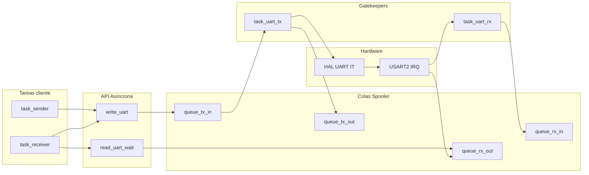

# TP1 – Actividad 02 – Device Driver UART de FreeRTOS

**CESE – Sistemas Operativos de Tiempo Real II**  
**Trabajo Práctico N° 1 – Device Driver**  
**Cohorte-Grupo:** 26Co2026-01  
**Responsable:** QUISPE LOPEZ, CARLOS (SIU e2614)  
**Plataforma:** NUCLEO-F446RE (STM32F446RE) @ **84 MHz**  
**Periférico:** **USART2** (115200 baud, PA2 TX / PA3 RX → ST-LINK VCP)  
**Toolchain:** STM32CubeIDE / GNU Tools for STM32  

---

## Paso 01: Generar el proyecto STM32

El proyecto **sotrii-tp1_02-application** fue generado con STM32CubeMX, importado en STM32CubeIDE y compila sin errores (**Project → Build All**).

---

## Paso 02: Crear el archivo de entrega

Se creó el archivo de entrega **`sotrii-tp1_02-application.md`** (este documento) en la raíz del proyecto.

---

## Paso 03: Análisis del código fuente base

Análisis de la funcionalidad del código base incluido en el proyecto:

| Archivo | Función principal |
|---------|-------------------|
| `app/src/app.c` | Inicialización (`app_init`), DWT, `open_uart(&huart2)` y arranque del scheduler FreeRTOS |
| `app/src/app_it.c` | Callbacks HAL UART (`TxCplt`, `RxCplt`, `Error`) e instrumentación WCET de ISR |
| `app/src/task_sender.c` | Tarea periódica; reporte WCET cada ~5 s vía `uart_if_wcet_report()` |
| `app/src/task_receiver.c` | Parser de comandos **ON/OFF + Enter**; respuestas por USART2 y control de LED |
| `app/src/task_uart.c` | Tareas gatekeeper **TX/RX** con `HAL_UART_Transmit_IT` / `Receive_IT` |
| `app/src/task_uart_interface.c` | API del device driver: `open_uart`, `write_uart`, `read_uart`, `ioctl_uart`, `release_uart` |
| `app/inc/task_uart_interface.h` | Prototipos de la API y variables globales WCET |
| `app/inc/dwt.h` | Contador de ciclos DWT para medición en microsegundos |

El sistema es **Event-Triggered (ETS)**: las tareas se despiertan por temporizador (`vTaskDelay`), por bytes UART en colas spooler y por semáforos liberados desde ISR.

---

## Paso 04: Depurar el nuevo proyecto STM32

Se confirmó mediante depuración en la NUCLEO-F446RE:

- Arranque correcto de `app_init` y de las tareas **Sender**, **Receiver**, **UART Tx** y **UART Rx**
- Logs por consola (semihosting) con el prefijo `[info]`
- Mensaje de listo del receptor: `UART listo (ON/OFF + ENTER)`
- Alternancia periódica del **Sender** cada **250 ms**
- Heartbeat del **Receiver** cada **25 iteraciones** (`alive - cnt=N`)

---

## Paso 05: *(Reservado / actividades intermedias del enunciado)*

---

## Paso 06: Device Driver UART FreeRTOS — Implementación, prueba y WCET

### 6.1 Aplicación realizada

Se diseñó e implementó un **Device Driver UART** sobre FreeRTOS que cumple los requisitos del enunciado:

| Requisito | Implementación |
|-----------|----------------|
| Estructura del dispositivo | `task_uart_dta_t` (`device_id`, colas spooler, semáforo TX, tareas gatekeeper) |
| Funciones de interfaz | `open_uart()`, `release_uart()`, `write_uart()`, `read_uart()`, `read_uart_wait()`, `ioctl_uart()` |
| Patrón de diseño | **Asynchronous** — la API encola y retorna sin esperar la transferencia serial |
| Gestión del periférico | **Interrupt** — `HAL_UART_Transmit_IT` / `HAL_UART_Receive_IT` |
| Acceso al hardware | API **STM32-F4 HAL** (`huart2` / USART2) |
| Tareas gatekeeper | `task_uart_tx`, `task_uart_rx` (creadas en `open_uart()`) |
| Almacenamiento | **Colas Input/Output Spooler** + **memoria dinámica** (`pvPortMalloc` / `vPortFree`) |
| Medición WCET | Contador **DWT** + variables globales + `uart_if_wcet_report()` |

#### Arquitectura del driver



**Flujo TX (asíncrono):**

1. `write_uart()` reserva buffer con `pvPortMalloc`, copia los datos y los encola en **input spooler TX** (`queue_tx_in`). Retorna de inmediato (`HAL_OK` / `HAL_BUSY`).
2. `task_uart_tx` (gatekeeper) toma el bloque y ejecuta `HAL_UART_Transmit_IT`.
3. Al completar, la ISR `HAL_UART_TxCpltCallback` libera un semáforo; el gatekeeper publica el estado en **output spooler TX** (`queue_tx_out`) y libera el buffer.

**Flujo RX (asíncrono):**

1. `open_uart()` y `ioctl_uart(UART_IOCTL_ARM_RX)` encolan `UART_RX_CMD_ARM` en **input spooler RX** (`queue_rx_in`).
2. `task_uart_rx` arma `HAL_UART_Receive_IT` (1 byte).
3. Cada byte recibido llega por ISR a **output spooler RX** (`queue_rx_out`).
4. `read_uart()` / `read_uart_wait()` leen del output spooler (con timeout 0 o configurable).

**Demostración funcional:**

| Tarea | Comportamiento |
|-------|----------------|
| `task_sender` | Cada **250 ms** registra actividad; cada **~5 s** (20 ciclos) imprime bloque WCET con `uart_if_wcet_report()` |
| `task_receiver` | Tras 300 ms envía `UART LISTO. CMD: ON / OFF + ENTER` por **USART2**; parsea comandos con **Enter**; responde `encendido` / `apagado`; enciende/apaga **LED_A** |

**Comandos aceptados (terminal serie @ 115200 8N1, p. ej. COM9 / Hercules):**

| Entrada (con Enter) | Respuesta UART | Efecto |
|---------------------|----------------|--------|
| `ON` | `encendido` | LED encendido |
| `OFF` | `apagado` | LED apagado |
| Otro texto | `CMD INVALIDO` | Sin cambio de LED |

**Inicialización relevante:**

1. `app_init()` → `cycle_counter_init()` + `open_uart(&huart2)` **antes** de `osKernelStart()`
2. Tras arrancar el scheduler, `task_receiver` arma RX y envía mensaje de bienvenida por UART
3. Cada ~5 s, `uart_if_wcet_report()` imprime el bloque WCET en consola semihosting

> **Dos canales de salida:** los logs `[info]` van al **depurador** (semihosting); las respuestas `encendido` / `apagado` salen por **USART2** (terminal serie).

---

### 6.2 Funciones utilizadas

#### API del Device Driver UART (`task_uart_interface.c`)

| Función | Descripción |
|---------|-------------|
| `open_uart(h_uart)` | Crea 4 colas spooler, semáforo TX y 2 tareas gatekeeper. Arma recepción IT |
| `release_uart(h_uart)` | Elimina tareas, colas y libera buffers pendientes |
| `write_uart(h, p_data, len)` | Encola bloque dinámico en input spooler TX (**async**) |
| `read_uart(h, &byte)` | Lee 1 byte del output spooler RX si está disponible (**non-blocking**) |
| `read_uart_wait(h, &byte, timeout)` | Lee bytes del spooler RX con timeout (usado por `task_receiver`) |
| `ioctl_uart(h, cmd)` | `FLUSH_RX`, `FLUSH_TX`, `ABORT_TX`, `ARM_RX` |
| `uart_if_wcet_report()` | Imprime WCET de interfaz y gatekeepers |

#### Tareas gatekeeper (`task_uart.c`)

| Tarea | Descripción |
|-------|-------------|
| `task_uart_tx` | Lee `queue_tx_in`, transmite con `HAL_UART_Transmit_IT`, notifica `queue_tx_out` |
| `task_uart_rx` | Atiende `queue_rx_in` (arm / flush) y gestiona recepción por interrupción |

#### Callbacks HAL (`app_it.c`)

| Callback | Acción |
|----------|--------|
| `HAL_UART_TxCpltCallback` | Señala fin de TX al gatekeeper (`uart_tx_cplt_notify_from_isr`) |
| `HAL_UART_RxCpltCallback` | Encola byte en `queue_rx_out` y re-arma `Receive_IT` |
| `HAL_UART_ErrorCallback` | Re-solicita armado RX tras error |

#### Tareas de aplicación

| Tarea | Archivo | Rol en la demo |
|-------|---------|----------------|
| `task_sender` | `task_sender.c` | Reporte WCET periódico y logs cada 250 ms |
| `task_receiver` | `task_receiver.c` | Comandos ON/OFF + Enter, respuestas UART y control de LED |

#### Medición WCET (DWT)

| Función / variable | Rol |
|--------------------|-----|
| `cycle_counter_init()` | Habilita contador DWT @ SYSCLK 84 MHz |
| `cycle_counter_reset()` / `cycle_counter_get_time_us()` | Mide tiempo en microsegundos |
| `g_uart_if_*_wcet_us` | Máximo WCET por función de interfaz |
| `g_task_uart_tx_runtime_us` / `g_task_uart_rx_runtime_us` | Tiempo de la última iteración del gatekeeper |
| `hal_xxxx_callback_runtime_us` | Tiempo de la última ejecución de ISR TX complete |

---

### 6.3 Resultados de las mediciones WCET

**Condiciones de medición:**

| Parámetro | Valor |
|-----------|-------|
| Placa | NUCLEO-F446RE |
| SYSCLK | 84 MHz |
| Periférico | USART2 @ 115200 baud |
| Instrumento | DWT (`cycle_counter_get_time_us`) |
| Visualización | Consola `[info]` + **Live Expressions** (STM32CubeIDE) |

#### Metodología

1. Inicializar DWT en `app_init()` → `cycle_counter_init()` **antes** de `open_uart()`.
2. Cada función de interfaz mide con `cycle_counter_reset()` / `cycle_counter_get_time_us()` y guarda el **máximo** en `g_uart_if_*_wcet_us`.
3. Gatekeepers actualizan `g_task_uart_tx_runtime_us` y `g_task_uart_rx_runtime_us` por iteración.
4. Observar en **Live Expressions** o consola semihosting con `uart_if_wcet_report()` (~ cada 5 s).
5. Enviar repetidamente **ON** y **OFF** + Enter desde Hercules para forzar TX/RX y registrar picos.

#### Cuadro resumen (completar con valores máximos de Live Expressions)

| N.º | Medición | Función / tarea | Variable (Live Expressions) | WCET [µs] |
|:---:|----------|-----------------|-----------------------------|----------:|
| 1 | Gatekeeper TX | `task_uart_tx` | `g_task_uart_tx_runtime_us` | **_COMPLETAR_** |
| 2 | Gatekeeper RX | `task_uart_rx` | `g_task_uart_rx_runtime_us` | **_COMPLETAR_** |
| 3 | Interfaz — apertura | `open_uart()` | `g_uart_if_open_wcet_us` | **_COMPLETAR_** |
| 4 | Interfaz — escritura (async) | `write_uart()` | `g_uart_if_write_wcet_us` | **_COMPLETAR_** |
| 5 | Interfaz — lectura | `read_uart()` / `read_uart_wait()` | `g_uart_if_read_wcet_us` | **_COMPLETAR_** |
| 6 | Interfaz — control | `ioctl_uart()` | `g_uart_if_ioctl_wcet_us` | **_COMPLETAR_** |
| 7 | Interfaz — cierre | `release_uart()` | `g_uart_if_release_wcet_us` | **_COMPLETAR_** |
| 8 | ISR TX Complete | `HAL_UART_TxCpltCallback` | `hal_xxxx_callback_runtime_us` | **_COMPLETAR_** |

> **Nota:** `g_uart_if_*_wcet_us` conserva el **máximo** observado durante toda la ejecución. Los gatekeepers e ISR registran la **última** iteración; para WCET anotar el **pico** visto en Live Expressions al enviar comandos ON/OFF.

**Valores orientativos esperados (orden de magnitud @ 84 MHz):**

| Función | Observación esperada |
|---------|---------------------|
| `write_uart()` | Bajo (~10–50 µs): solo `pvPortMalloc` + `xQueueSend` |
| `read_uart()` | Muy bajo (~5–15 µs): `xQueueReceive` con timeout 0 |
| `open_uart()` | Medio (~100–400 µs): creación de colas y tareas |
| `task_uart_tx` | Alto vs API: incluye transmisión serial (~87 µs/byte @ 115200) + espera IT |
| ISR TX | Muy bajo (~2–10 µs) |

#### Ejemplo de bloque WCET en consola (semihosting)

Tras ~5 s de ejecución aparece:

```
[info] === WCET Funciones Interfaz UART [us] ===
[info]   open_uart()    : XXX
[info]   release_uart() : XXX
[info]   write_uart()   : XXX
[info]   read_uart()    : XXX
[info]   ioctl_uart()   : XXX
[info] === WCET Gatekeeper UART [us] ===
[info]   task_uart_tx   : XXX
[info]   task_uart_rx   : XXX
```

#### Análisis breve

1. **`write_uart()` es asíncrona:** retorna cuando el mensaje quedó encolado, no cuando salió por el pin TX; su WCET es bajo comparado con el gatekeeper TX.
2. **`task_uart_tx`** concentra el mayor tiempo: encolado previo + `HAL_UART_Transmit_IT` + espera del semáforo + tiempo serial (~87 µs/byte @ 115200).
3. **`open_uart()`** crea recursos del driver; se ejecuta una sola vez antes del scheduler.
4. **`ioctl_uart()`** puede invocarse desde API o gatekeeper RX (`ARM_RX`, `FLUSH_RX`).
5. **`release_uart()`** puede reportar **0 µs** si no fue invocada en la demo (el driver permanece abierto).
6. El patrón **asíncrono** con gatekeepers evita condiciones de carrera en el periférico compartido.

---

### 6.4 Video de demostración

Prueba en video del funcionamiento del sistema (depuración, logs semihosting, comandos ON/OFF por UART):

**Enlace:** [Video demo — uart.mp4 (Google Drive)](https://drive.google.com/file/d/1LrjPOwOcyrQ1-tT1F7ImvYy7Lz4fXK9W/view?usp=sharing)

---

### 6.5 Evidencia — Log de consola

Salida obtenida durante la sesión de depuración con driver UART operativo y comandos **ON/OFF + Enter** habilitados:

```
[info]  
[info] app_init is running - Tick [mS] = 0
[info]  app is a RTOS - Event-Triggered Systems (ETS)
[info]  app is a sotrii-tp1_02-application: Demo Code
[info]  app is a (Source => CESE - Sistemas Operativos de Tiempo Real
[info]  
[info]   Task Receiver is running - Tick [mS] = 0
[info]  
[info]   Task Sender is running - Tick [mS] = 0
[info]    ==> Task SENDER - Wait:   250mS
[info]  
[info] Task UART Tx is running - Tick [mS] =   0
[info]  
[info] Task UART Rx is running - Tick [mS] =   0
[info]    ==> Task SENDER - Wait:   250mS
[info]   Task RECEIVER - UART listo (ON/OFF + ENTER)
[info]    ==> Task SENDER - Wait:   250mS
[info]    ==> Task SENDER - Wait:   250mS
[info]    ==> Task SENDER - Wait:   250mS
[info]    ==> Task SENDER - Wait:   250mS
[info]    ==> Task SENDER - Wait:   250mS
[info]    ==> Task SENDER - Wait:   250mS
[info]    ==> Task SENDER - Wait:   250mS
[info]    ==> Task SENDER - Wait:   250mS
[info]    ==> Task SENDER - Wait:   250mS
[info]    ==> Task SENDER - Wait:   250mS
[info]    ==> Task RECEIVER - alive - cnt=25
[info]    ==> Task SENDER - Wait:   250mS
```

> El bloque `=== WCET Funciones Interfaz UART [us] ===` se imprime cada **~5 s** (20 × 250 ms). Copiar esos valores a la tabla de la sección 6.3.

---

### 6.6 Configuración hardware

| Parámetro | Valor |
|-----------|-------|
| Periférico | USART2 |
| TX | PA2 |
| RX | PA3 |
| Velocidad | 115200 baud, 8N1 |
| VCP | ST-LINK Virtual COM Port (p. ej. COM9) |
| LED demo | LED_A (board) — ON/OFF según comando |
| Depuración | Semihosting (`LOGGER_CONFIG_USE_SEMIHOSTING = 1`) |

---

### 6.7 Archivos modificados / agregados

| Archivo | Cambio |
|---------|--------|
| `app/inc/task_uart_attribute.h` | Estructuras del device driver y colas spooler |
| `app/inc/task_uart_interface.h` | Prototipos API + variables WCET |
| `app/src/task_uart_interface.c` | Implementación API (`open`, `write`, `read`, …) |
| `app/src/task_uart.c` | Tareas gatekeeper TX/RX |
| `app/src/app_it.c` | Callbacks HAL UART (IT) |
| `app/src/app.c` | Orden init DWT + `open_uart(&huart2)` |
| `app/src/task_sender.c` | Reporte WCET periódico |
| `app/src/task_receiver.c` | Demo comandos ON/OFF + Enter |
| `sotrii-tp1_02-application.md` | Este documento |

---

### 6.8 Pasos para compilar, depurar y medir

1. Abrir el proyecto en **STM32CubeIDE**.
2. **Project → Build All** (verificar 0 errores).
3. Conectar NUCLEO-F446RE por USB; habilitar semihosting según el curso.
4. **Run → Debug**; agregar variables WCET a **Live Expressions**.
5. Abrir terminal serie (Hercules) @ **115200 8N1** en el COM del ST-LINK.
6. Enviar `ON` + Enter y `OFF` + Enter repetidamente.
7. Esperar reportes de `uart_if_wcet_report()` (~ cada 5 s) y anotar máximos en la tabla 6.3.

---

**Fin del Paso 06 – Actividad 02**
